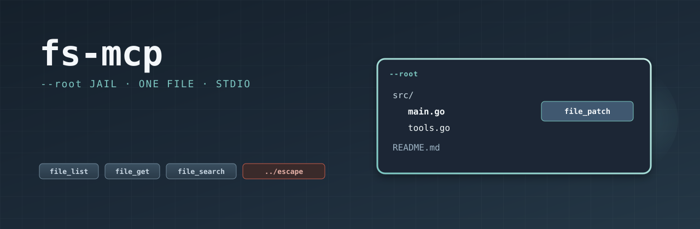

# fs-mcp

<p align="center">
  
</p>

<p align="center">
  <a href="https://github.com/shotah/fs-mcp/actions/workflows/ci.yml"></a>
  <a href="https://github.com/shotah/fs-mcp/actions/workflows/release.yml"></a>
  <a href="https://github.com/shotah/fs-mcp/actions/workflows/ci.yml"></a>
  <a href="https://pkg.go.dev/github.com/shotah/fs-mcp"></a>
  
  <a href="LICENSE"></a>
</p>

Workspace files over MCP stdio. Server id `fs`. The host calls `fs__file_get`.

Naming: [george docs/mcp-naming.md](https://github.com/shotah/george/blob/main/docs/mcp-naming.md). The coding-agent grant is [docs/coding-mcp.md](https://github.com/shotah/george/blob/main/docs/coding-mcp.md).

## Tools

| Tool | Tier | Host call |
| --- | --- | --- |
| `file_list` | core | `fs__file_list` |
| `file_get` | core | `fs__file_get` |
| `file_search` | core | `fs__file_search` |
| `file_create` | core | `fs__file_create` |
| `file_patch` | core | `fs__file_patch` |
| `file_delete` | write | `fs__file_delete` |

`--root` is the jail. A path that leaves it, including through a symlink, is refused. A leading `/` that is not already inside the jail is the workspace root (`/c.txt` is `c.txt`). `file_patch` replaces exact text (`old`/`new`) or applies one unified diff, and writes nothing when the edit does not match.

## Run

```bash
go install github.com/shotah/fs-mcp@latest
fs-mcp --root /workspace --tool-tier core
```

```toml
[[server]]
name    = "fs"
command = "fs-mcp"
args    = ["--root", "/workspace", "--tool-tier", "core"]
force   = true
```

## Development

```bash
make lint
make test
make coverage   # fails below 70%
make release    # patch bump; BUMP=minor|major or TAG=v0.2.0
```

CI (`.github/workflows/ci.yml`) runs the same lint, tests, and `scripts/check-coverage.sh` at 70%. `make check` is the local equivalent. `make release` writes `VERSION`, tags `v*` and floating `latest`, and pushes so the Release workflow runs.
